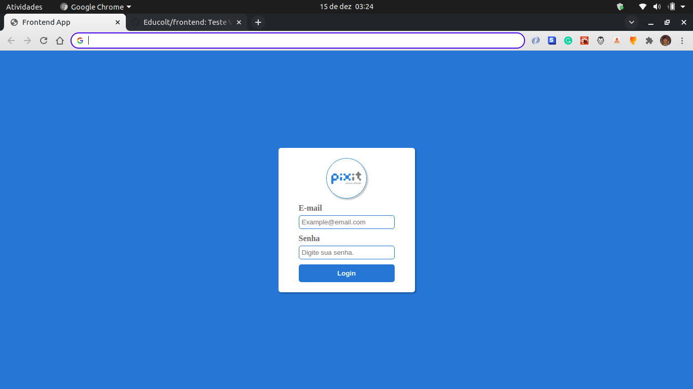
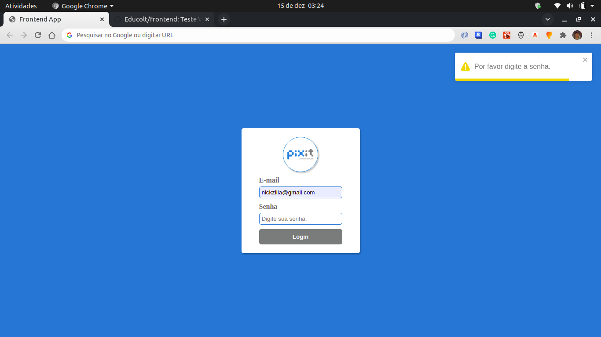
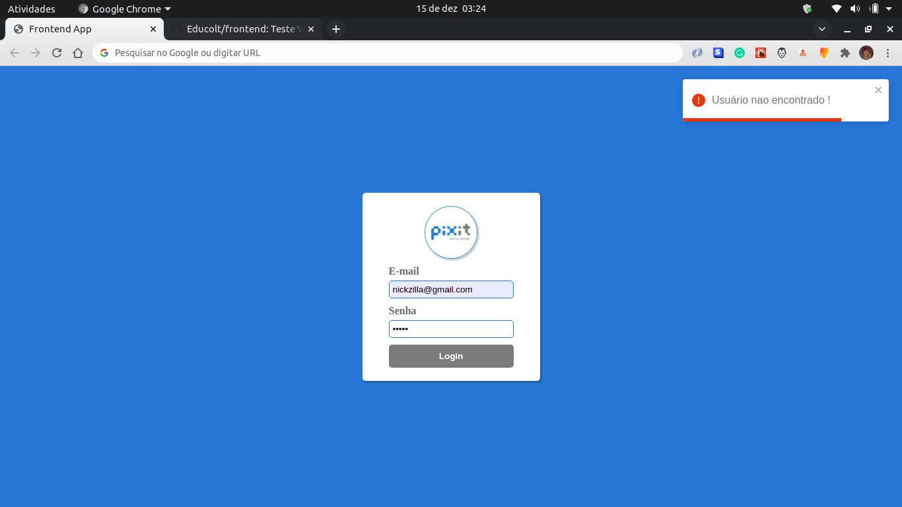
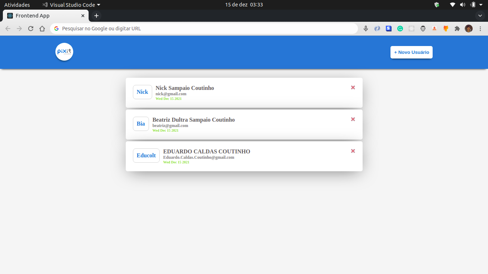
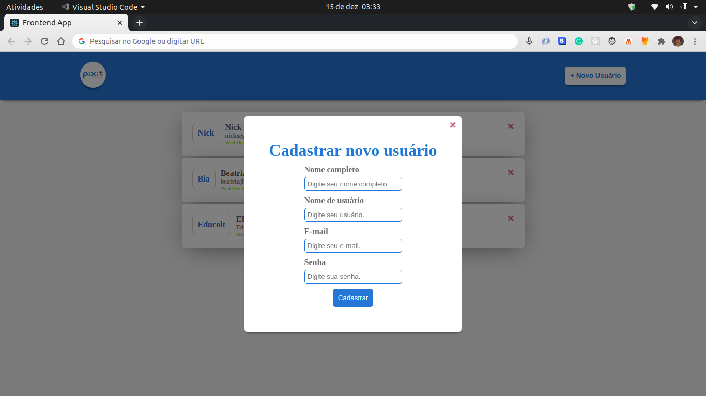
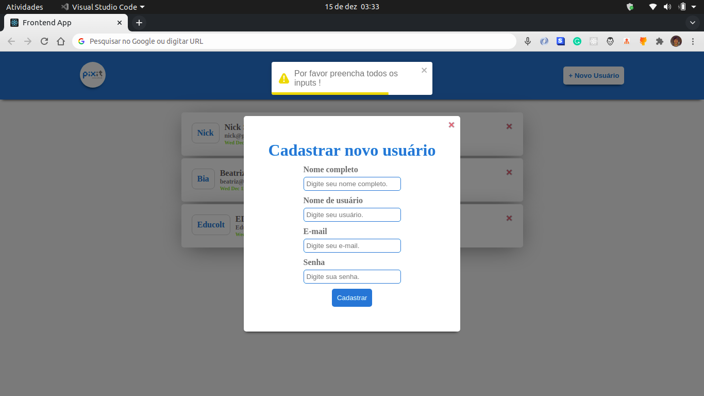
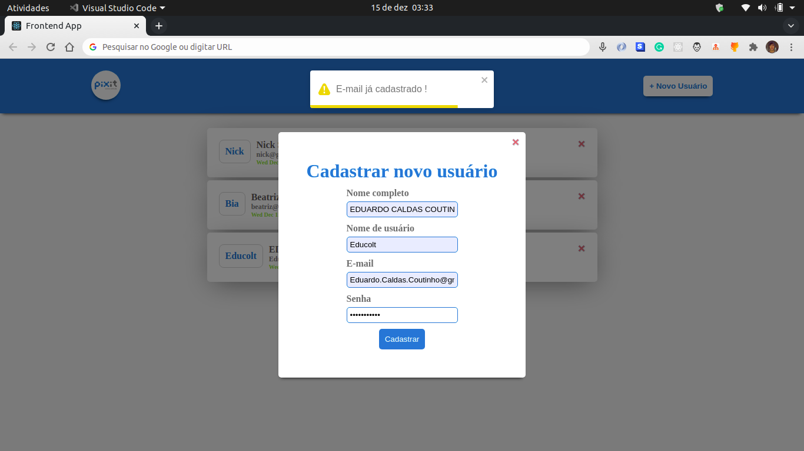

<h1 align="center" style="color: black;">
    
</h1>

---


# 📍 Indíce

- [Sobre](#🔖-sobre)
- [Tecnologias Utilizadas](#🚀-tecnologias-utilizadas)
- [Como instalar o projeto](#🗂-como-instalar-o-projeto)
- [Desenvolvedor](#🧔-Desenvolvedor)

---

## 🔖 Sobre

Aplicação desenvolvida para solução do Desafio da Vaga Backend Dev Pleno. [Notion](https://astonishing-squash-4a3.notion.site/Desafio-Vaga-Pixit-Backend-8e0032f98bc94d45b12f6ae3ab3efbd8), [PDF do Desafio](https://drive.google.com/file/d/1FnNFrGalxAivDPQwfk9TKNnCZ7f-0igY/view?usp=sharing)

---
## 💻 Paginas

## # SignIn - Autenticação

<h1 align="center">

  

</h1>

<h1 align="center">

  

</h1>

<h1 align="center">

  

</h1>

## # Dashboard - Users

<h1 align="center">

  

</h1>

## # Cadastro - User

<h1 align="center">

  

</h1>

## # Cadastro - User - Validation

<h1 align="center">

  

</h1>

<h1 align="center">

  

</h1>

## 🚀 Tecnologias Utilizadas

O projeto foi desenvolvido utilizando as seguintes tecnologias

- [Back-end](https://github.com/Educolt/backend)
- [ReactJS](https://pt-br.reactjs.org/)
- [styled-components](https://styled-components.com/)
- [react-toastify](https://fkhadra.github.io/react-toastify/introduction)
- [Typescript](https://www.typescriptlang.org/)
- [axios](https://axios-http.com/docs/intro)

---

## 🗂 Como instalar o projeto

```bash
  # Clonar o repositório
  $ git clone https://github.com/Educolt/frontend

  # Entrar no diretório
  $ cd frontend

  # Instalar as dependencias
  $ yarn

  # Start App
  $ yarn start

```
⚠️ Atention: Antes de rodar o app, setar o valor da porta em que à api está rodando.

---

### 🧔 Desenvolvedor
Desenvolvido 💜 por Eduardo caldas Coutinho.